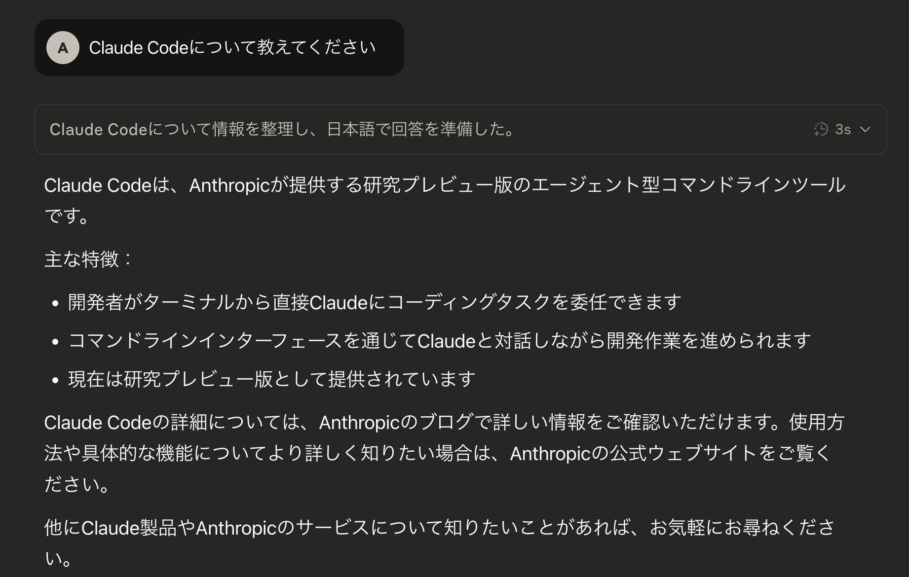
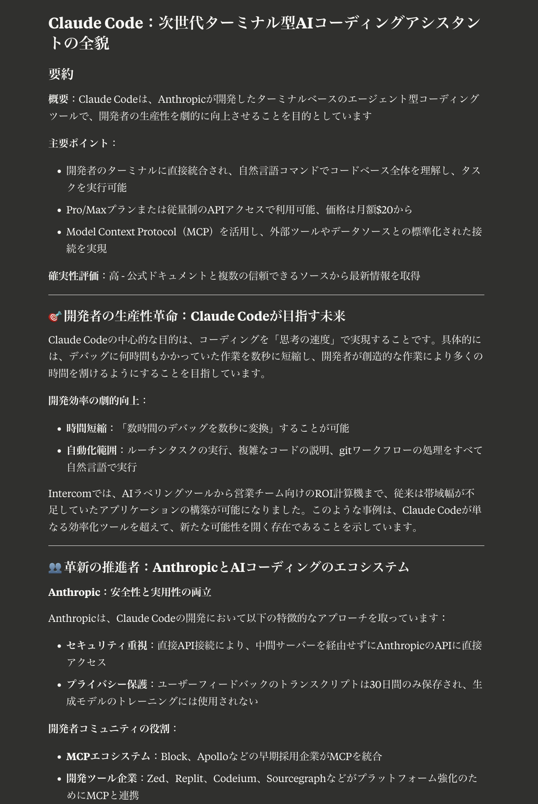
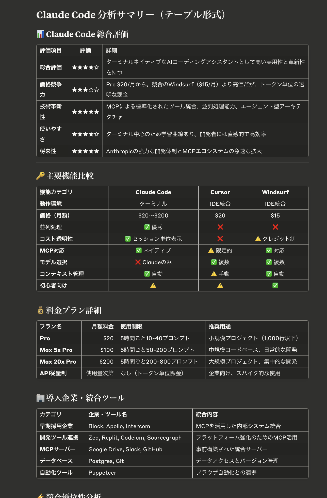

# Claude手製Deep Research

## これは何か

- Claudeのプロジェクト機能を利用して、擬似的に、「検索→調査→詳細なまとめ」を行うDeepResearch機能を模倣する、出力機能強化システムです。

## 何ができるのか

- 本来ならばシンプルな結果になる出力を大幅に強化します。
- メリット:
   - ChatGPT DeepResearchは利用回数数が制限されていますが、手製Deep Researchは、単純なプロンプト術に過ぎないので利用回数制限がありません。
   - 普通の出力では、生成結果が短く、要点が抜けていることがあります。
   - このような時は、繰り返し質問しなければいけません。
   - しかし、手製Deep Researchの利用で「一発出し」で大量の情報を出力可能になります。
   - 時間がない時に、質問だけして、分析を作らせて、後で読むといった用法に向いています。
- デメリット：
   - トークン消費が激しいため、デイリーの利用制限が近くなります。

## 何に使えるか

- 生成AIの特性からして「単なる情報の羅列」 に過ぎません。
- しかし、「ある分野の2025年の人気書籍と、概要の一覧、販売が出版社の傾向」といった、「情報をサマライズして、閲覧したい事例」には非常に強みとなります。

## 実際の出力例

### 入力例
```
Claude Codeについて教えてください
```

### 通常の出力
[Claude Codeについて教えてください](https://claude.ai/share/206fe200-0b8d-47bc-8866-6b32b76e82d2)


### 強化版の出力
- [Claude Code Overview - Claude](https://claude.ai/chat/e2f1636a-83f1-4fdd-884c-63eadb9f1b20)
   - [Claude Code：次世代ターミナル型AIコーディングアシスタントの全貌](https://claude.ai/public/artifacts/e44817d0-5597-431c-9801-63defae05178)
   - [Claude Code 分析サマリー（テーブル形式）](https://claude.ai/public/artifacts/011b2625-b77b-431c-92e6-8da25ee0a5c0)



## ChatGPT DeepResearchとの違い

- メリット: 
   - ChatGPTに比べて、テーブルや箇条書きを利用した読みやすい結果を出力できる
- デメリット:
   - ChatGPT DeepResearchに比べると、
   - 明確に厳密性に劣る(Terraformなどのライブラリで、存在しないモジュールをハルシネーションする)
   - 段階を踏んだ推論を繰り返すDeepResearchに比べて、単に「大量の検索を利用した、一発出力」に過ぎない、あくまでサマライズである

## 使い方
* Claude > Projects画面に入ります

* 新規プロジェクトを作成します。
* 右側のプロジェクト「Set project instructions」を開きます。

* 初期プロンプト欄に[project-init.md](./project-init.md)の内容を全てコピー＆ペーストします


以上。


* 注意：PerplexityAPI, AWSドキュメントサーチなどなど、Claude MCPを使いたい場合は別途設定します。ただし、searchがWEB UIで実装されたため、2025年6月現在は、MCP不要です。
