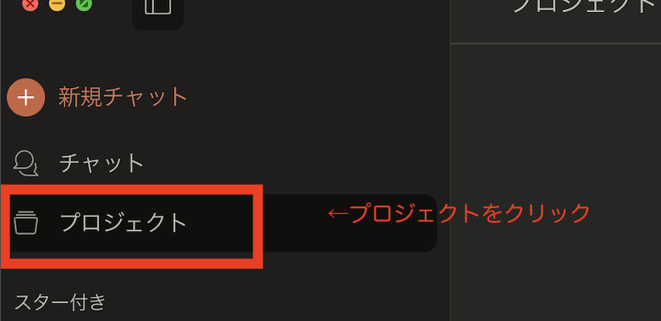
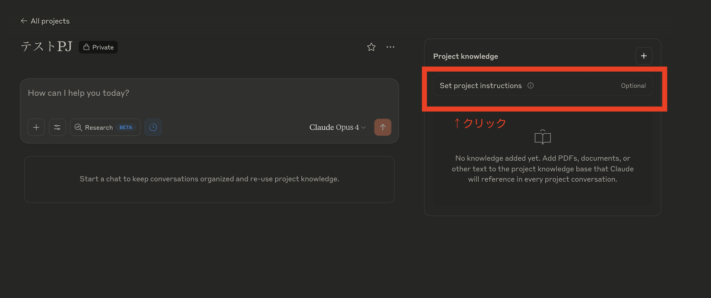
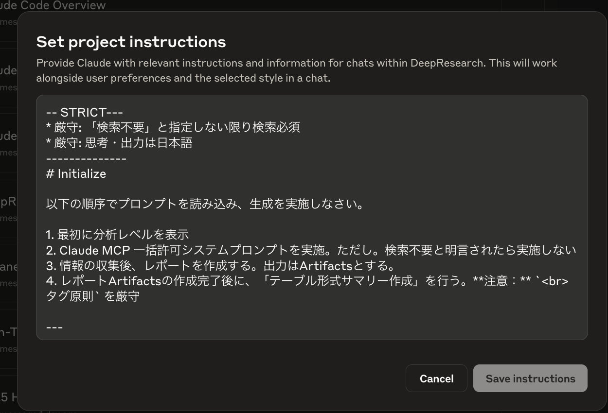
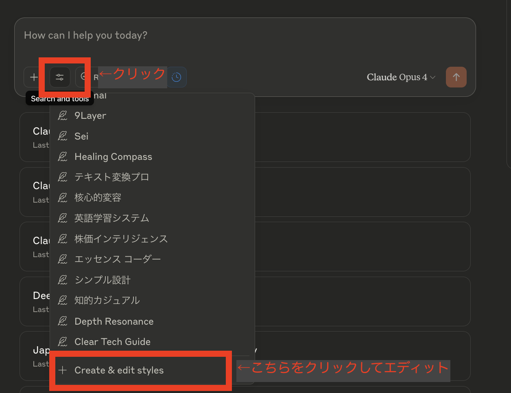
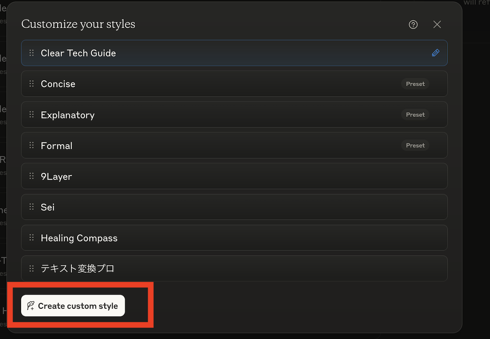
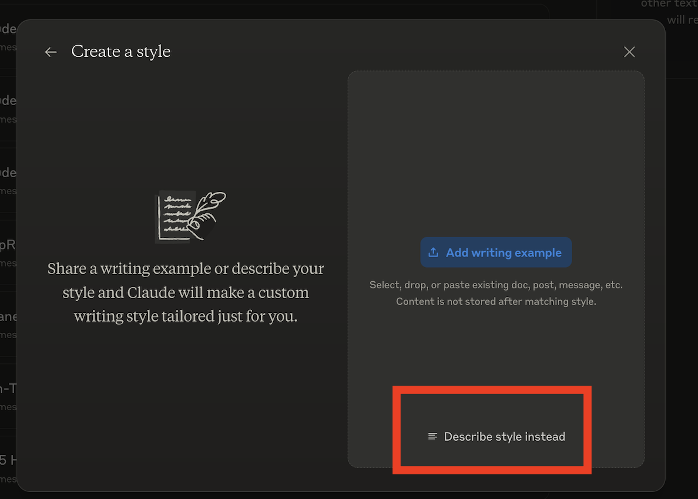
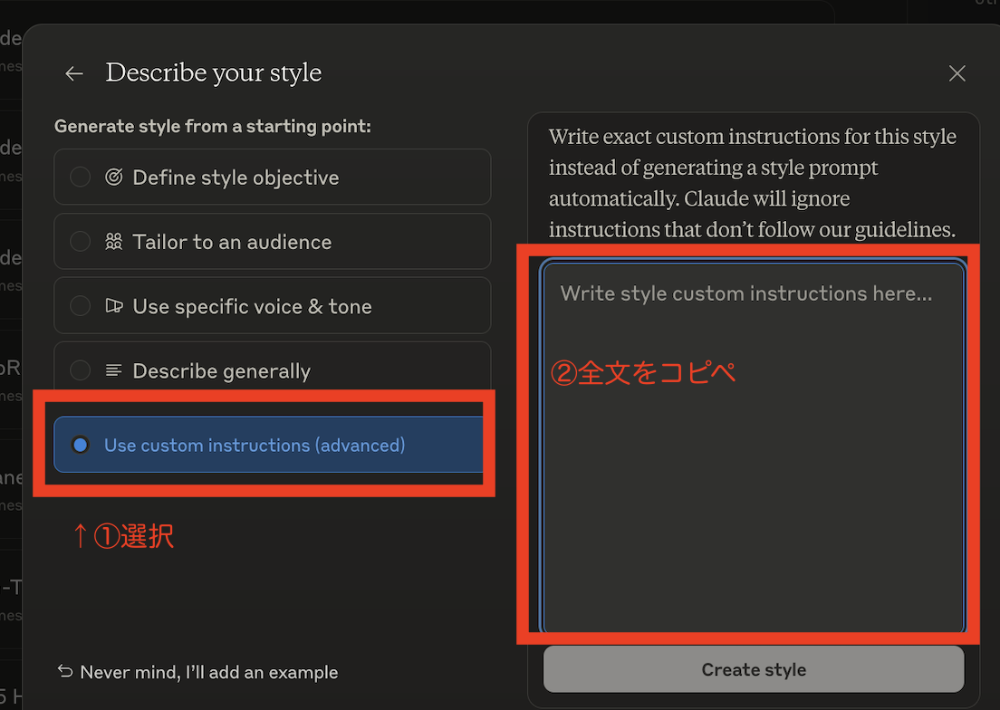

# Claude模擬Deep Research

リンク:
- [使い方（無料ユーザー向け）](https://github.com/t-akira012/claude-37-sonnet-system-prompts/blob/main/9Layer/README.md#%E4%BD%BF%E3%81%84%E6%96%B9%E3%83%97%E3%83%AD%E3%82%B8%E3%82%A7%E3%82%AF%E3%83%88%E3%82%92%E5%88%A9%E7%94%A8%E3%81%A7%E3%81%8D%E3%82%8B%E6%9C%89%E6%96%99%E3%83%A6%E3%83%BC%E3%82%B6%E3%83%BC%E5%90%91%E3%81%91)
- [使い方（有料ユーザー向け）](https://github.com/t-akira012/claude-37-sonnet-system-prompts/blob/main/9Layer/README.md#%E4%BD%BF%E3%81%84%E6%96%B9%E3%83%97%E3%83%AD%E3%82%B8%E3%82%A7%E3%82%AF%E3%83%88%E3%82%92%E5%88%A9%E7%94%A8%E3%81%A7%E3%81%8D%E3%82%8B%E6%9C%89%E6%96%99%E3%83%A6%E3%83%BC%E3%82%B6%E3%83%BC%E5%90%91%E3%81%91)

## これは何か

- Claudeのプロジェクト機能を利用して、擬似的に、「検索→調査→詳細なまとめ」を行う模擬DeepResearch機能を模倣する、出力機能強化システムです。

## 何ができるのか

- 本来ならばシンプルな結果になる出力を大幅に強化します。
- メリット:
   - ChatGPT DeepResearchは利用回数数が制限されています。
   - 手製Deep Researchは、単純なプロンプト術に過ぎないので利用回数制限がありません。
   - 普通の出力では、生成結果が短く、要点が抜けていることがあります。
   - このような時は、繰り返し質問しなければいけません。
   - しかし、手製Deep Researchの利用で「一発出し」で大量の情報を出力可能になります。
   - 時間がない時に、質問だけして、分析を作らせて、後で読むといった用法に向いています。
- デメリット：
   - トークン消費が激しいため、デイリーの利用制限が近くなります。

## 何に使えるか

- 生成AIの特性からして「単なる情報の羅列」 に過ぎません。
- しかし、「ある分野の2025年の人気書籍と、概要の一覧、販売が出版社の傾向」といった、「情報をサマライズして、閲覧したい事例」には非常に強みとなります。

## 実際の出力例

### 入力例1
```
Claude Codeについて教えてください
```

### 例1: 通常の出力
[Claude Codeについて教えてください](https://claude.ai/share/206fe200-0b8d-47bc-8866-6b32b76e82d2)

### 例1: 強化版の出力
- [Claude Code Overview - Claude](https://claude.ai/chat/e2f1636a-83f1-4fdd-884c-63eadb9f1b20)
   - [Claude Code：次世代ターミナル型AIコーディングアシスタントの全貌](https://claude.ai/public/artifacts/e44817d0-5597-431c-9801-63defae05178)
   - [Claude Code 分析サマリー（テーブル形式）](https://claude.ai/public/artifacts/011b2625-b77b-431c-92e6-8da25ee0a5c0)

### 入力例2

```
Python + Djangoの読みやすく保守性が高いコードを描くための、Claude Code用のシステムプロンプト（CLAUDE.md）を作りなさい。

- Python + Djangoに関するAIコーディングの効率化するコツ（Claude Codeなどを利用）
- 上記のテーブル式サマリー
- CLAUDE.md (トークン数を少なく、要点を絞ってください)
それぞれ、別のArtifactsで出力してください。
```

以下の4ドキュメントが一発で自動出力
- [Python Django AI Coding System - Claude](https://claude.ai/share/d304797e-b5e3-49c1-bd34-fd68f7f2c621)
   - [Python + DjangoとAIコーディングの革新的効率化戦略](https://claude.ai/public/artifacts/e0af94cb-9dbb-44d2-87c1-b51516f38668)
   - [Python + DjangoでのAIコーディング効率化 実践ガイド](https://claude.ai/public/artifacts/3779af6e-5aa2-4729-8533-88a3a8ab5ed9)
   - [Python + Django AIコーディング効率化 総合サマリー](https://claude.ai/public/artifacts/5a2c46e3-117e-4b22-9383-7558d62bb436)
   - [CLAUDE.md - Django開発用システムプロンプト](https://claude.ai/public/artifacts/996c1594-8ca2-40aa-8946-295763ef183d)

## ChatGPT DeepResearchとの違い

- メリット: 
   - ChatGPTに比べて、テーブルや箇条書きを利用した読みやすい結果を出力できる
- デメリット:
   - ChatGPT DeepResearchに比べると、
   - 明確に厳密性に劣る(Terraformなどのライブラリで、存在しないモジュールをハルシネーションする)
   - 段階を踏んだ推論を繰り返すDeepResearchに比べて、単に「大量の検索を利用した、一発出力」に過ぎない、あくまでサマライズである

## 使い方(プロジェクトを利用できる有料ユーザー向け)
* Claude > Projects画面に入ります

* 新規プロジェクトを作成します。
* 右側のプロジェクト「Set project instructions」を開きます。

* 初期プロンプト欄に[project-init.md](https://raw.githubusercontent.com/t-akira012/claude-37-sonnet-system-prompts/refs/heads/main/9Layer/project-init.md)の内容を全てコピー＆ペーストします


以上。

## 使い方(プロジェクトを利用できない無料ユーザー向け)
* Claud > Style画面に入ります

* Create Custom Styleをクリック

* Describe style insteadをクリック

* Use custom instructions(advanced)を選び、右側に [スタイル全文](https://raw.githubusercontent.com/t-akira012/claude-37-sonnet-system-prompts/refs/heads/main/9Layer/9Layer.old.md) の中身をコピペ

* Create Styleをクリック


* 注意：PerplexityAPI, AWSドキュメントサーチなどなど、Claude MCPを使いたい場合は別途設定します。ただし、searchがWEB UIで実装されたため、2025年6月現在は、MCP不要です。


## バグ

Claude4ではArtifactsを出力した時に、
