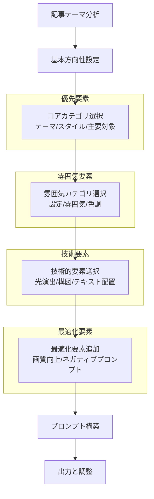

# note記事の見出し画像の生成用プロンプトジェネレーター

## ⚡ プロンプトジェネレーターの目的と特徴

**5秒要約：** このジェネレーターは、Claude情報発信用のnote記事に最適な見出し画像を生成するためのプロンプトを構築するシステムで、共感・自然・ポップ・ハートフルな雰囲気を重視します。

**システム概要：**
このプロンプトジェネレーターは、AI画像生成ツールで使用するためのテキストプロンプトを体系的に構築できるシステムです。特にnote.comの記事見出し画像（1280×670px）に最適化されており、AIエンジニアがClaudeに関する情報を発信する際に、技術的な内容を親しみやすく伝えるための画像プロンプトを生成します。

**主要特徴：**
* 共感、自然、ポップ、ハートフルな雰囲気を優先
* AIらしさを抑え、人間味のある温かな表現を重視
* 体系的なYAML構造で要素を組み合わせ可能
* note記事の見出し画像サイズ（1280×670px）に最適化
* 技術的内容を親しみやすく表現するための要素を多数収録

---

## 🌟 基本構造（YAML形式）

```yaml
theme: string          # 全体のテーマ（例：共感、教育、技術解説）
style: string          # 視覚的スタイル（例：ミニマル、アニメ調、水彩画）
subject: string        # 主要対象（例：Claude、AI、人間）
setting: string        # 背景設定（例：未来的オフィス、自然、抽象的背景）
mood: string           # 全体の雰囲気（例：明るい、優しい、活気のある）
color_scheme: string   # 色調（例：パステル調、ビビッド、モノクローム）
lighting: string       # 光の演出（例：温かな日差し、柔らかい光、ハイライト）
composition: string    # 構図（例：中央配置、ルールオブサード、対角線）
text_element: string   # テキスト要素（例：タイトル、キャッチコピー、なし）
enhancement: string    # 画質向上指定（例：高解像度、鮮明さ、デティール）
negative_prompt: string # 避けたい要素（例：暗い雰囲気、機械的、複雑すぎる）
```

---

## 📊 要素カテゴリとオプション

### 1. テーマ (theme)
テーマは全体の方向性を決定する最も重要な要素です。

```yaml
themes:
  - 共感と理解: "empathy and understanding"
  - 学びと成長: "learning and growth"
  - 技術と人間の調和: "harmony between technology and humanity"
  - 親しみやすいAI: "friendly and approachable AI"
  - 日常の中のテクノロジー: "technology in everyday life"
  - 創造性の拡張: "expanding creativity"
  - 未来への希望: "hope for the future"
  - パートナーシップ: "partnership and collaboration"
  - 問題解決: "problem solving together"
  - 知識の共有: "sharing knowledge"
```

### 2. 視覚的スタイル (style)
画像全体の芸術的アプローチを指定します。

```yaml
styles:
  - シンプルイラスト: "simple, clean illustration style"
  - 手描き風: "hand-drawn style with visible brush strokes"
  - 水彩画風: "soft watercolor style with gentle color blending"
  - フラットデザイン: "flat design with minimal shadows"
  - 親しみやすい3Dレンダリング: "friendly 3D rendering with soft edges"
  - ポップアート: "vibrant pop art style with bold colors"
  - コラージュ: "mixed media collage style combining different elements"
  - 絵本風: "storybook illustration style with warmth and detail"
  - 線画とカラー: "line art with cheerful coloring"
  - 日本のアニメ風: "anime-inspired style with expressive features"
```

### 3. 主要対象 (subject)
画像の中心となる要素や人物を指定します。

```yaml
subjects:
  - フレンドリーなClaudeキャラクター: "friendly Claude character with a warm smile and approachable demeanor"
  - 人間とAIの協力: "human and AI character working together side by side"
  - 多様な人々: "diverse group of people of different ages and backgrounds"
  - 対話の様子: "conversation scene with speech bubbles and expressive gestures"
  - 考え中のキャラクター: "thoughtful character with lightbulb or thought clouds"
  - 学習中の様子: "character engaged in learning with books or digital screens"
  - 問題解決のメタファー: "visual metaphor for problem solving like puzzle pieces or maze"
  - 成長と進化の象徴: "symbols of growth like plants, stairs, or opening doors"
  - 創造的な制作風景: "creative workspace with tools and inspirational elements"
  - 感情表現: "expressive character showing emotions like joy, curiosity, or wonder"
```

### 4. 背景設定 (setting)
主要対象を取り巻く環境や場所を指定します。

```yaml
settings:
  - 明るい自然環境: "bright natural environment with sunshine and greenery"
  - カラフルな抽象背景: "colorful abstract background with soft shapes and patterns"
  - 居心地の良いインテリア: "cozy interior space with warm lighting and comfortable furniture"
  - 未来的でも温かみのある空間: "futuristic yet warm space with soft glowing lights"
  - 街並みのシルエット: "city skyline silhouette with gradient sky"
  - 図書館や学習空間: "library or learning space with books and knowledge symbols"
  - グラデーションの空: "gradient sky with soft color transitions"
  - 宇宙をイメージした背景: "space-inspired background with stars and gentle cosmic elements"
  - 季節を感じる風景: "seasonal landscape with characteristic elements"
  - デジタルと自然の融合: "blend of digital elements and natural elements"
```

### 5. 全体の雰囲気 (mood)
画像から感じ取れる感情的な調子を指定します。

```yaml
moods:
  - 明るく前向き: "bright and positive atmosphere"
  - 穏やかで安心感: "calm and reassuring mood"
  - 好奇心と探求心: "curious and exploratory feeling"
  - 温かい友情: "warm friendship and connection"
  - 創造的でわくわくする: "creative and exciting energy"
  - 思いやりと共感: "caring and empathetic tone"
  - 優しさと包容力: "gentle and inclusive feeling"
  - 活気と希望: "vibrant and hopeful atmosphere"
  - 落ち着きと集中: "peaceful focus and concentration"
  - 喜びと満足感: "joyful and satisfying mood"
```

### 6. 色調 (color_scheme)
画像の色彩の特徴を指定します。

```yaml
color_schemes:
  - パステルカラー: "soft pastel colors creating a gentle atmosphere"
  - 明るい原色: "bright primary colors with a playful feel"
  - 調和のとれた補色: "harmonious complementary colors"
  - グラデーション: "smooth color gradients transitioning between related hues"
  - 温かみのある色調: "warm color palette with oranges, yellows and soft reds"
  - 清潔感のある青と白: "clean blues and whites with a fresh feel"
  - 自然の色彩: "natural color palette inspired by outdoors"
  - ポップで明るい配色: "pop and bright color combinations that feel cheerful"
  - モノクロにアクセントカラー: "monochromatic scheme with one accent color"
  - やさしい地色に鮮やかなポイント: "soft background colors with vibrant highlights"
```

### 7. 光の演出 (lighting)
画像の照明効果や光の質を指定します。

```yaml
lighting:
  - 柔らかい自然光: "soft natural lighting creating a comfortable atmosphere"
  - 温かいバックライト: "warm backlighting creating a glowing outline"
  - やわらかなスポットライト: "gentle spotlight highlighting the main subject"
  - 明るく均一な照明: "bright even lighting with minimal shadows"
  - 朝日や夕日のような光: "golden hour lighting like sunrise or sunset"
  - 柔らかなグラデーション: "soft gradient lighting from one side"
  - 魔法のような光の粒子: "magical light particles floating gently"
  - 室内の温かい照明: "warm indoor lighting creating a homey feel"
  - ほのかな光沢: "subtle glow and gentle highlights"
  - 窓からの光: "light streaming through windows creating soft beams"
```

### 8. 構図 (composition)
画像の要素配置や視点を指定します。

```yaml
compositions:
  - バランスの良い中央配置: "balanced centered composition with main subject in the middle"
  - 三分割法: "rule of thirds composition with strategic element placement"
  - 開放的な空間: "open composition with plenty of breathing space"
  - 左右対称: "symmetrical composition creating harmony and balance"
  - 斜めの構図: "diagonal composition creating dynamic movement"
  - フレーミング効果: "framing elements surrounding the main subject"
  - 遠近感のある奥行き: "perspective view creating depth and dimension"
  - 俯瞰アングル: "gentle top-down view showing arrangement of elements"
  - テキスト配置を考慮した余白: "composition with deliberate space for headline text"
  - 視線誘導のライン: "leading lines guiding the eye to the main subject"
```

### 9. テキスト要素 (text_element)
画像に含めるテキストの特徴を指定します。

```yaml
text_elements:
  - 目立つタイトル用のスペース: "prominent space for title with clean background area"
  - 手書き風フォント: "hand-written style fonts with personal touch"
  - 丸みのあるポップなフォント: "rounded, pop-style typography that feels friendly"
  - テキストバナー: "text banner or ribbon for headline placement"
  - 浮き出るテキスト: "text with subtle drop shadow or outline for readability"
  - テキスト用のフレーム: "decorative frame or border for text placement"
  - ミニマルでモダンなフォント: "minimal modern typography with clean lines"
  - テキストなし（別途追加）: "no text elements in the image"
  - 柔らかい吹き出し: "soft speech or thought bubbles for text"
  - カリグラフィ風: "calligraphy-inspired decorative text style"
```

### 10. 画質向上指定 (enhancement)
画像の技術的な品質を向上させるための指定です。

```yaml
enhancements:
  - 高解像度: "high resolution, detailed image"
  - 鮮明な輪郭: "sharp clear outlines and edges"
  - 適度なコントラスト: "balanced contrast for visual clarity"
  - プロフェッショナルな仕上がり: "professional quality rendering and details"
  - 視覚的な調和: "visually harmonious with balanced elements"
  - note推奨サイズ: "optimized for note.com headline image size (1280×670px)"
  - 目を引くビジュアル: "eye-catching visual with focal point"
  - クリーンなデザイン: "clean design without clutter or noise"
  - 読みやすさ重視: "emphasis on readability and visual clarity"
  - シームレスな統合: "seamlessly integrated elements creating unified whole"
```

### 11. 避けたい要素 (negative_prompt)
画像に含めたくない要素を指定します。

```yaml
negative_prompts:
  - 機械的で冷たい雰囲気: "avoid mechanical, cold, or sterile atmosphere"
  - 複雑すぎる背景: "avoid overly complex or busy backgrounds"
  - 暗く重い印象: "avoid dark, heavy, or oppressive mood"
  - 過度に技術的な表現: "avoid overly technical or complicated visuals"
  - ステレオタイプなAI表現: "avoid stereotypical AI imagery like binary code or generic robots"
  - 圧迫感のある構図: "avoid crowded or cluttered composition"
  - 不自然なポーズや表情: "avoid unnatural poses or expressions"
  - 過度な写実性: "avoid hyper-realistic or uncanny valley effects"
  - 散漫な注意を引く要素: "avoid distracting elements that pull focus"
  - 読みにくいテキスト配置: "avoid text placement that interferes with readability"
```

---

## 🔄 プロンプト構築プロセス (mermaid図)



---

## 📝 プロンプト構築テンプレート

以下のテンプレートに沿って要素を組み合わせることで、最終的なAI画像生成プロンプトを作成します。

```
[テーマ], [視覚的スタイル], [主要対象], [背景設定], [全体の雰囲気], [色調], [光の演出], [構図], [テキスト要素], [画質向上指定]. Negative prompt: [避けたい要素]
```

**テンプレート例（日本語）：**
```
「共感と理解」をテーマにした、手描き風イラストで、フレンドリーなClaudeキャラクターが明るい自然環境の中にいる、明るく前向きな雰囲気の構図。パステルカラーを基調とし、柔らかい自然光で照らされたバランスの良い中央配置。タイトル用のスペースを確保し、高解像度で注目を引くビジュアル。1280×670ピクセルのnote見出し画像に最適化。
ネガティブプロンプト: 機械的で冷たい雰囲気、複雑すぎる背景、暗く重い印象、過度に技術的な表現、ステレオタイプなAI表現
```

**テンプレート例（英語）：**
```
Theme of "empathy and understanding", hand-drawn style with visible brush strokes, friendly Claude character with a warm smile and approachable demeanor, bright natural environment with sunshine and greenery, bright and positive atmosphere, soft pastel colors creating a gentle atmosphere, soft natural lighting creating a comfortable atmosphere, balanced centered composition with main subject in the middle, prominent space for title with clean background area, high resolution, detailed image optimized for note.com headline image size (1280×670px). Negative prompt: avoid mechanical, cold, or sterile atmosphere, avoid overly complex or busy backgrounds, avoid dark, heavy, or oppressive mood, avoid overly technical or complicated visuals, avoid stereotypical AI imagery like binary code or generic robots
```

---

## 💡 アイディア生成マトリックス

様々なnote記事の種類に合わせたプロンプト構成の組み合わせ例です。

| 記事タイプ | 推奨テーマ | 推奨スタイル | 推奨主要対象 | 推奨雰囲気 |
|------------|------------|--------------|--------------|------------|
| 入門解説 | 学びと成長 | シンプルイラスト | 学習中の様子 | 好奇心と探求心 |
| ケーススタディ | 問題解決 | フラットデザイン | 問題解決のメタファー | 活気と希望 |
| テクニックTips | 知識の共有 | 線画とカラー | 考え中のキャラクター | 落ち着きと集中 |
| ユーザーストーリー | 共感と理解 | 水彩画風 | 多様な人々 | 温かい友情 |
| 未来展望 | 未来への希望 | 親しみやすい3Dレンダリング | 成長と進化の象徴 | 創造的でわくわくする |
| AIと人間関係 | 技術と人間の調和 | 絵本風 | 人間とAIの協力 | 思いやりと共感 |

---

## ⚙️ 実装方法

1. **記事内容の分析**
   - 記事の主要テーマとメッセージを特定
   - ターゲット読者のニーズと期待を考慮

2. **要素の選択**
   - 各カテゴリから最適な要素を1つ選択
   - テーマ、主要対象、全体の雰囲気を優先的に決定

3. **プロンプト構築**
   - テンプレートに沿って選択した要素を組み合わせる
   - 必要に応じて追加の具体的な指示を追加

4. **最適化と調整**
   - noteのフォーマット要件に合わせる（1280×670ピクセル）
   - 読みやすさと視覚的魅力のバランスを確認

5. **レビューと生成**
   - 最終プロンプトをレビューして調整
   - AI画像生成ツールに入力して画像を作成

---

## 📚 使用例

### 例1: Claude基本機能の解説記事

**選択要素:**
- テーマ: 学びと成長
- スタイル: シンプルイラスト
- 主要対象: フレンドリーなClaudeキャラクター
- 設定: 居心地の良いインテリア
- 雰囲気: 好奇心と探求心
- 色調: 明るい原色
- 光: 柔らかい自然光
- 構図: テキスト配置を考慮した余白
- テキスト要素: 丸みのあるポップなフォント
- 画質向上: note推奨サイズ

**生成プロンプト:**
```
Theme of "learning and growth", simple clean illustration style, friendly Claude character with a warm smile and approachable demeanor, cozy interior space with warm lighting and comfortable furniture, curious and exploratory feeling, bright primary colors with a playful feel, soft natural lighting creating a comfortable atmosphere, composition with deliberate space for headline text, rounded pop-style typography that feels friendly, optimized for note.com headline image size (1280×670px). Negative prompt: avoid mechanical, cold, or sterile atmosphere, avoid stereotypical AI imagery like binary code or generic robots
```

### 例2: AIとの共創に関する記事

**選択要素:**
- テーマ: 創造性の拡張
- スタイル: 水彩画風
- 主要対象: 人間とAIの協力
- 設定: カラフルな抽象背景
- 雰囲気: 創造的でわくわくする
- 色調: グラデーション
- 光: 魔法のような光の粒子
- 構図: 三分割法
- テキスト要素: 目立つタイトル用のスペース
- 画質向上: 視覚的な調和

**生成プロンプト:**
```
Theme of "expanding creativity", soft watercolor style with gentle color blending, human and AI character working together side by side, colorful abstract background with soft shapes and patterns, creative and exciting energy, smooth color gradients transitioning between related hues, magical light particles floating gently, rule of thirds composition with strategic element placement, prominent space for title with clean background area, visually harmonious with balanced elements optimized for note.com headline image size (1280×670px). Negative prompt: avoid overly complex or busy backgrounds, avoid dark, heavy, or oppressive mood, avoid overly technical or complicated visuals
```

## 🔑 成功のためのコツ

1. **シンプルさを保つ**
   - 1つの画像に詰め込む要素は最小限に
   - 主要なメッセージを伝えることに焦点を合わせる

2. **テキスト配置を考慮**
   - 記事タイトルを配置するための余白や背景を確保
   - テキストの読みやすさを優先する色のコントラスト

3. **一貫性のある色調**
   - 2-3色の限られた色調で統一感を出す
   - noteのブランドや記事のテーマに合った色を選択

4. **親しみやすさの要素**
   - 温かみのある光や色彩
   - 柔らかい形状と優しい表現
   - 親しみやすい表情や姿勢

5. **ポップでハートフルな要素**
   - 明るく前向きな雰囲気
   - 感情を表現する視覚的要素
   - 人間らしさと温かみを伝える細部

---

## ⚠️ 注意点と制限

- このプロンプトジェネレーターは画像そのものではなく、画像生成用のプロンプトを作成します
- 生成されたプロンプトは英語での使用を前提としていますが、日本語に翻訳することも可能です
- 各AI画像生成ツールによって最適なプロンプト構造が異なる場合があります
- 著作権やブランドガイドラインに従った使用を心がけてください
- 実際の画像は生成ツールによって異なる結果になる可能性があります

---

## 📈 継続的改善のための指針

このプロンプトジェネレーターは固定的なものではなく、以下の方法で継続的に改善できます：

1. 生成結果のフィードバックを収集し、効果的な要素の組み合わせを見つける
2. 新しいスタイルやトレンドに合わせて要素を追加・更新する
3. note記事のパフォーマンスデータから、効果的な見出し画像の特徴を分析する
4. ユーザーの好みや反応に基づいて要素の優先順位を調整する
5. 特定のトピックや記事タイプに特化した要素セットを開発する

---

## 🌈 最終チェックリスト

生成したプロンプトを使用する前に、以下の点を確認してください：

- [ ] 記事の本質とメッセージを画像が反映しているか
- [ ] 「共感、自然、ポップ、ハートフル」の要素が含まれているか
- [ ] AIらしさよりも人間味のある表現になっているか
- [ ] note推奨サイズ（1280×670px）に最適化されているか
- [ ] テキスト配置のための適切なスペースが確保されているか
- [ ] 視覚的に魅力的で、読者の注目を引くデザインか
- [ ] 記事の内容と一貫性のあるビジュアルメッセージか
- [ ] 技術的な内容が親しみやすく表現されているか
