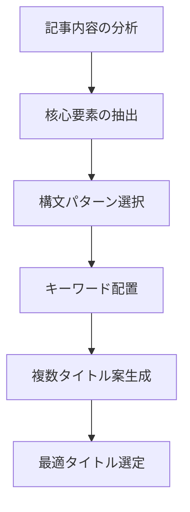

# Claude用 note記事タイトル生成プロンプト

## 🎯 目的

このプロンプトは、AIエンジニアがClaudeに関する情報発信をnoteで行う際に、効果的なタイトルを生成するためのものです。優れたタイトルは読者の注目を集め、クリック率を高め、記事の価値を最大限に引き出します。

## 📊 タイトル生成の基本構造

```yaml
入力パラメータ:
  記事テーマ: [Claude関連の主要トピック]
  ターゲット読者: [想定読者層と関心]
  記事の主要ポイント: 
    - [ポイント1]
    - [ポイント2]
    - [ポイント3]
  差別化ポイント: [他の記事との違い]
  望ましい印象: [記事から得られる印象]
  文字数制限: "25文字前後が理想（最大40文字）"
```

## 🔄 タイトル生成フロー



## 📝 効果的な構文パターン

### 1. 数値型パターン
```yaml
パターン: "[数字]分で[成果/効果]を[実現する方法]"
パターン: "[数字]つの[手法/方法]で[目標]を[達成]"
パターン: "[数字]年[職業]が教える[ノウハウ]"
```

### 2. 問題解決型パターン
```yaml
パターン: "[課題]を[解決方法]で乗り越える"
パターン: "もう[課題]で悩まない！[解決策]の全て"
パターン: "[問題]を[解決方法]で[改善効果]にする方法"
```

### 3. 比較型パターン
```yaml
パターン: "[製品A]と[製品B]を徹底比較：[結論]"
パターン: "[従来手法]より[新手法]が優れる[数値]の理由"
パターン: "[A]vs[B]：[専門家]が選ぶのは？"
```

### 4. ハウツー型パターン
```yaml
パターン: "【実践】[目標]のための[手法]入門"
パターン: "[専門用語]を[簡単/効率的]に[実装する方法]"
パターン: "[職業]のための[技術]活用術"
```

### 5. 発見・洞察型パターン
```yaml
パターン: "[現象]から見える[洞察]の真実"
パターン: "知っておくべき[技術]の[特性/側面]"
パターン: "あなたも[誤解/間違い]をしていませんか？[正しい理解]"
```

### 6. ケーススタディ型パターン
```yaml
パターン: "事例で学ぶ：[企業/プロジェクト]の[技術]活用法"
パターン: "[実績]を達成した[プロジェクト]の舞台裏"
パターン: "[専門家]が明かす[成功事例]の[秘訣]"
```

### 7. トレンド・最新情報型パターン
```yaml
パターン: "【[年]年最新】[技術]の[変化/進化]と[影響]"
パターン: "今知っておくべき[技術]の[トレンド]"
パターン: "[技術]の未来：[専門家]が予測する[展望]"
```

## 🔎 効果を高める要素

### キーワード配置の原則
```yaml
- 重要キーワードは文頭に配置
- 専門用語と一般用語をバランスよく配置
- 検索されやすい技術名を含める
- 数字を活用して具体性を高める
```

### 感情価値の活用
```yaml
- 知的好奇心を刺激する語句：「驚きの」「意外な」「知られざる」
- 安心感を与える語句：「検証済み」「実績ある」「確実な」
- 成長意欲に訴える語句：「進化する」「次世代」「最適化」
```

### 差別化要素の強調
```yaml
- 独自の視点：「～だけが知る」「～視点から見る」
- 専門性：「現役エンジニアが解説」「開発現場で実証済み」
- 実用性：「すぐに使える」「明日から実践できる」
```

## 🔄 評価とリファイン

生成したタイトル案を以下の基準で評価します：

```yaml
評価基準:
  - クリック率：読者の興味を引く力
  - 明確性：記事内容が直感的に理解できるか
  - 専門性：ターゲット読者に適した専門レベルか
  - 差別化：他の記事と差別化できているか
  - 検索適性：検索されやすいキーワードを含んでいるか
  - 期待値管理：記事内容と一致しているか（誇大表現になっていないか）
```

## 使用方法

1. 記事の内容を「入力パラメータ」に沿って整理します
2. 記事の特性に合わせて適切な「構文パターン」を選択します
3. 「効果を高める要素」を参考にキーワードや表現を調整します
4. 複数のタイトル案を生成して「評価とリファイン」で最適なものを選びます

## 注意点

- タイトルは25文字前後が最も効果的（最大でも40文字まで）
- 誇大表現やクリックベイトは避け、記事内容と一致させる
- 専門用語と一般用語のバランスを考慮する
- note特有の文化（真面目で誠実な情報発信）に合わせる
